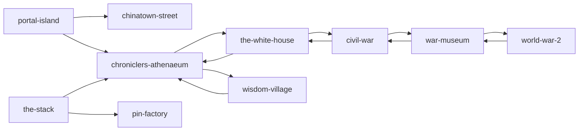
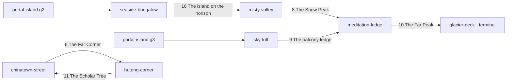

# The Scene Map — orphan audit and a plan to link it up

**Date:** 2026-09-12
**Scope:** `src/scenes/*.js` — which scenes can be reached from another scene, which cannot, and where the missing doors should go.

---

## 1. How linking works today

- A locus may carry `link: '<scene-id>'` and an optional `linkLabel`. `src/viewer/loci.js` reads exactly **one link per locus** — but a scene can carry as many links as it has loci.
- `LocusOverlay.js` renders it as a single button in the locus panel; `sceneHref()` resolves 2D and 3D scenes the same way, so any scene can be a target.
- The hub (`src/main.js`) is a **flat list of all 24 registered scenes**. Every scene is reachable from the hub. "Orphan" here means something narrower and more interesting: **a scene that no other scene points at, so it exists on the index page but nowhere in the world.**

---

## 2. The map as it stands

24 registered scenes. 12 `link:` edges. One connected web of 10 scenes, one two-scene fragment, and 14 islands.

**The connected web (10):** portal-island → chinatown-street / chroniclers-athenaeum → the-white-house, wisdom-village → civil-war → war-museum → world-war-2. Portal Island is the de-facto root: it is the only scene with doors out and none in.

**The detached fragment (2):** `the-stack` links *out* to the Athenaeum and the Pin Factory, but nothing links *in* to it. `pin-factory` is a pure sink.

**Fully isolated — no inbound, no outbound (14):**

| Scene | What it is | Kind |
|---|---|---|
| `solar-system` | The Sun to the Kuiper Belt, 12 loci | subject |
| `india-history` | River of Time, 25 loci | subject |
| `nobel-hall` | 2021–25 laureates, 32 loci | subject |
| `macro-hydraulic-hall` | MONIAC, macro series hub, 11 loci | subject / hub |
| `cfa-level-1` | CFA Financial District, 27 loci | subject |
| `the-stack`* | Software engineering city, 51 loci | subject |
| `pin-factory`* | Division of labour, 16 loci | subject |
| `body-heart` | The Pump House, 17 loci | subject (series) |
| `body-lungs` | The Bellows Cathedral, 14 loci | subject (series) |
| `grab-workplace` | The Green Court, 25 loci | personal |
| `seaside-bungalow` | 16 blank pegs | empty palace |
| `sky-loft` | 16 blank pegs | empty palace |
| `misty-valley` | 8 blank pegs | empty palace |
| `hutong-corner` | 14 blank pegs | empty palace |
| `meditation-ledge` | 10 blank pegs | empty palace |
| `glacier-deck` | **0 loci** — free-move only | empty palace |

\* has outbound edges but no inbound.

**A second class of orphan — off the hub entirely.** Six scene configs existed with a matching `.glb` in `models/` but no entry in `src/scenes/index.js`, so they were unreachable by any route. **All six were removed on 2026-09-12** (see Phase 6) — listed here for the record:

| File | glb | Read |
|---|---|---|
| `writing-room.js` | 1.2 MB | Typewriter, bookshelf, manuscript pile, hourglass — **and Portal Island gate 1 is already labelled "Phòng viết lách"** |
| `time-machine.js` | 820 KB | Orrery, present marker, near past, deep past, origin |
| `coffee-shop.js` | 372 KB | Five loci, small |
| `castle.js` | 192 KB | Six loci, placeholder boxes |
| `city.js` | 192 KB | Six loci, placeholder boxes |
| `luan-hoi-dai.js` | 5.0 MB | **Superseded** — `portal-island` now carries the title "Luân Hồi Đài" |

Also unused: `models/wisdom-village_detailed_backup.glb`, `models/civil-war-map.glb` (replaced by the 2D `civil-war`).

---

## 3. Two things the audit makes obvious

**(a) You already built the doors — you just never wired them.** Portal Island has eight ring gates and only the Rosetta causeway and the Library rotunda do anything. Three gates are literally titled `xx`, and three of the named ones name scenes that now exist:

| Gate | Existing title / description | Obvious target |
|---|---|---|
| 1 | Phòng viết lách — "nơi lưu trữ các tác phẩm viết lách" | **no scene** — `writing-room` was deleted 2026-09-12; gate is now a free slot |
| 2 | Seava Hồ Tràm — "cổng dẫn đến **Bungalow biển**" | `seaside-bungalow` |
| 3 | Lux Garden — "chung cư" (apartment block) | `sky-loft` |
| 7 | Spaceship — "dự án công nghệ và **phòng thí nghiệm cá nhân**" | `the-stack` |
| 5, 6, 8 | `xx` | free slots |
| 9 | The Piano — "phòng âm nhạc" | no music scene yet — leave |

The same is true elsewhere: Wisdom Village has **11 open plots** each waiting for a thinker, the Athenaeum has **11 unlinked rooms**, the War Museum has **5 sand tables** with no scene behind them, and `macro-hydraulic-hall` locus 9 is a door-board called "The Nine Doors — the map of the series."

**(b) There is no rule for what links to what.** Left alone, this ends as 24 scenes each hanging off Portal Island. Proposed rule, which the existing edges already almost follow:

> **Portal Island is the front door and holds *places*. The Athenaeum is the library and holds *subjects*. Wisdom Village holds the *people* behind the ideas. The War Museum holds wars. Work links from the Green Court.**

And one convention you already use twice (Liberty ↔ Library, Owl ↔ Observatory), worth making universal:

> **Every door is a pair.** If A links to B, B links back to A from the locus that makes sense. No one-way streets, so any scene can be a starting point.

---

## 4. The proposed wiring

### Phase 1 — free wins, no design decisions (6 edits)

*Status: gate 2 ↔ `seaside-bungalow` wired both ways 2026-09-12 (return leg on the bungalow's locus 7, The glass sliding door).*

| From | Locus | To | Suggested `linkLabel` |
|---|---|---|---|
| ✅ `portal-island` | 2 · Seava Hồ Tràm | `seaside-bungalow` | Bước qua cổng: Bungalow biển → |
| `portal-island` | 3 · Lux Garden | `sky-loft` | Bước qua cổng: The Sky Loft → |
| `portal-island` | 10 · हिन्दी Hindi | `india-history` | Through the Hindi gate: River of Time → |
| `body-heart` | 8 · The Lung Loop | `body-lungs` | Follow the blood into the lungs → |
| `body-lungs` | 12 · Both Traffics | `body-heart` | Back to the pump → |
| `chinatown-street` | 6 · The Far Corner | `hutong-corner` | The same corner in Beijing → |

The Hindi gate follows the precedent already set by gate 11 (中文 → `chinatown-street`). Heart ↔ Lungs is the one link the content already assumes: "The Lung Loop" and "Both Traffics" describe each other's scenes.

### Phase 2 — the subject wing: the Athenaeum becomes the index

The Athenaeum's thirteen rooms are the best-shaped hooks in the project — each is already a discipline. Give each its scene, and a return link from that scene's first or last locus.

| Athenaeum locus | → | Return from |
|---|---|---|
| 7 · The Celestial Observatory | `solar-system` | locus 1 · The Sun |
| 8 · The Cartography Wing | `war-museum` | locus 1 · The Hall of Sand Tables |
| 10 · The Great Reading Room | `nobel-hall` | locus 1 · Alfred Nobel's medal |
| 13 · The Herbarium & Medicinal Garden | `body-heart` | locus 1 · The Intakes |
| 11 · Scribe's Scriptorium | *hold* — `writing-room` was deleted; reserve for a rebuilt writing scene | |
| 9 · Giant Armillary Sphere | *hold* — `time-machine` was deleted; reserve for a rebuilt chronology scene | |
| 5 · The Alchemist's Lab | *hold* — reserve for the first chemistry/materials scene | |
| 4 · The Rare Manuscripts Vault | *hold* — the natural door to **The Quarry** when it is built | |

This alone takes `solar-system`, `nobel-hall` and the body series off the island list, and gives `the-stack`'s Antilibrary Gate a partner: the Athenaeum should link back to `the-stack`, but no room fits — see Phase 4.

### Phase 3 — the economics cluster

`macro-hydraulic-hall`, `pin-factory` and `cfa-level-1` are three scenes about the same thing that touch each other nowhere.

| From | Locus | To | Why |
|---|---|---|---|
| `wisdom-village` | Plot 07 · The Longhouse | `pin-factory` | A long barn with a clerestory ridge *is* Smith's long bench. Assign Plot 07 to Adam Smith and rewrite its peg note. |
| `wisdom-village` | Plot 11 · The Mill | `macro-hydraulic-hall` | Machinery that runs on flow. Phillips's plot. |
| `wisdom-village` | Plot 06 · The Glass Cube | `cfa-level-1` | Buffett's plot → the Financial District. |
| `pin-factory` | last locus (16) | `macro-hydraulic-hall` | One firm becomes an economy. |
| `macro-hydraulic-hall` | 4 · The Firm Tank | `pin-factory` | The firm tank, opened up. |
| `macro-hydraulic-hall` | 5 · The Banks | `cfa-level-1` | Where the savings drain goes. |
| `cfa-level-1` | 9 · Economics · The cycle and the two levers | `macro-hydraulic-hall` | The return leg. |
| `nobel-hall` | 28 · 2022 Economics — Bernanke, Diamond & Dybvig | `macro-hydraulic-hall` | Bank runs → the banks circuit. |

Net effect: Wisdom Village stops being a cul-de-sac of empty plots and becomes the entry point for the whole economics side, which is what it was always for.

### Phase 4 — work and software

| From | Locus | To | Why |
|---|---|---|---|
| `portal-island` | 7 · Spaceship | `the-stack` | Its existing description is literally "personal tech projects and lab". |
| `portal-island` | 5 or 6 · `xx` | `grab-workplace` | Name the gate "The Green Court". |
| `grab-workplace` | 4 · The Building on the Plinth | `the-stack` | "Infra carries the room you are standing in" — and The Stack is that room, drawn out. |
| `the-stack` | 24 · The Guild Hall | `grab-workplace` | Brooks' law → the real org. |
| `grab-workplace` | 22 · The Open Door | *hold* for **The Quarry** | Both are the antilibrary. Wire it the day the Quarry ships. |

### Phase 5 — the quiet circuit

Six scenes with blank pegs (`seaside-bungalow`, `sky-loft`, `misty-valley`, `meditation-ledge`, `hutong-corner`, `glacier-deck`) are not subjects and should not hang off the Athenaeum. Chain them instead, so one gate reaches all of them, and let each link sit on the locus that already looks out of the scene:

Note the one exception to "every door is a pair": **`glacier-deck` has no loci at all**, so it can be a destination but can never link back. It is the only legitimate dead end in the project — which suits a room whose whole point is that there is nothing to do there. Worth a line in its blurb so the dead end reads as intent.

### Phase 6 — the unregistered six — **DONE (2026-09-12)**

All six were removed rather than registered: `writing-room`, `time-machine`, `coffee-shop`, `castle`, `city`, `luan-hoi-dai` — both the `src/scenes/*.js` config and the `models/*.glb`. Every file was tracked in git, so all twelve are recoverable from history (`git checkout <commit> -- <path>`) if a scene is wanted back.

Consequences to pick up elsewhere:

- **Portal Island gate 1 ("Phòng viết lách") now points at nothing.** Either rebuild a writing room, repoint the gate, or count it among the free slots in Phase 4.
- **Athenaeum rooms 9 (Armillary Sphere) and 11 (Scriptorium) lose their intended targets** and go back on hold, alongside 4 and 5.
- `scripts/build_glb.py` still carries export recipes for `coffee-shop`, `writing-room` and `time-machine`. Harmless — the `.blend` sources in `blender_models/` were left alone — but they are dead config and can be pruned.
- Still unused and safe to remove on the next pass: `models/wisdom-village_detailed_backup.glb`, `models/civil-war-map.glb` (the 2D `civil-war` replaced the relief plate).

---

## 5. After all six phases

Every registered scene has at least one inbound edge; every scene except `glacier-deck` has an outbound one; the graph is a web with four named districts rather than a list. Edge count goes from 12 to roughly 40.

Loose ends deliberately left open: Portal Island gate 9 (The Piano) has no music scene; Rosetta's French and Arabic gates have no scene; the Athenaeum's Alchemist's Lab and Manuscripts Vault are reserved; five War Museum sand tables (Cannae, Bạch Đằng, Somme, Điện Biên Phủ, Sài Gòn 1975) still have no scene behind the arch; `macro-hydraulic-hall`'s nine doors still lead nowhere. Those are scene backlog, not wiring bugs — and the empty slot is doing its job as an antilibrary marker.
